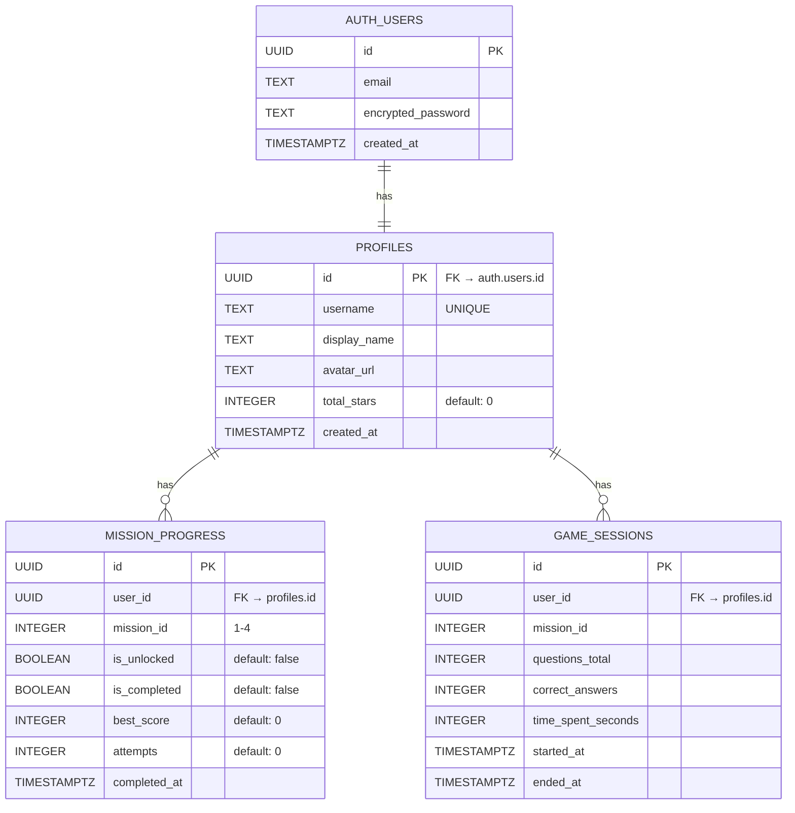

# 🗄️ Cosmic Math Adventure — Database Schema

Dokumentasi lengkap skema database Supabase (PostgreSQL) untuk project Cosmic Math Adventure.

---

## 1. Entity Relationship Diagram



---

## 2. Tabel Detail

### 2.1 `profiles`

Menyimpan informasi profil pemain. Dibuat otomatis saat user register.

| Column | Type | Constraints | Default | Description |
|---|---|---|---|---|
| `id` | UUID | PK, FK → `auth.users.id` | — | User ID dari Supabase Auth |
| `username` | TEXT | UNIQUE, NOT NULL | — | Username untuk login |
| `display_name` | TEXT | NOT NULL | — | Nama panggilan anak ("Kapten [Nama]") |
| `avatar_url` | TEXT | NULLABLE | `NULL` | URL avatar custom (opsional) |
| `total_stars` | INTEGER | NOT NULL | `0` | Total bintang yang dikumpulkan |
| `created_at` | TIMESTAMPTZ | NOT NULL | `now()` | Waktu registrasi |

**Indexes:**
- `profiles_pkey` — PRIMARY KEY (`id`)
- `profiles_username_key` — UNIQUE (`username`)

---

### 2.2 `mission_progress`

Melacak progress dan status unlock setiap misi per user.

| Column | Type | Constraints | Default | Description |
|---|---|---|---|---|
| `id` | UUID | PK | `gen_random_uuid()` | Primary key |
| `user_id` | UUID | FK → `profiles.id`, NOT NULL | — | Referensi user |
| `mission_id` | INTEGER | NOT NULL, CHECK (1-4) | — | ID misi: 1=Counting, 2=Addition, 3=Subtraction, 4=Comparison |
| `is_unlocked` | BOOLEAN | NOT NULL | `false` | Apakah misi sudah terbuka |
| `is_completed` | BOOLEAN | NOT NULL | `false` | Apakah misi sudah diselesaikan |
| `best_score` | INTEGER | NOT NULL | `0` | Skor terbaik (0-5 bintang) |
| `attempts` | INTEGER | NOT NULL | `0` | Jumlah percobaan |
| `completed_at` | TIMESTAMPTZ | NULLABLE | `NULL` | Waktu pertama kali selesai |

**Indexes:**
- `mission_progress_pkey` — PRIMARY KEY (`id`)
- `mission_progress_user_mission_key` — UNIQUE (`user_id`, `mission_id`)

**Constraints:**
- `mission_id` CHECK: `mission_id BETWEEN 1 AND 4`
- `best_score` CHECK: `best_score BETWEEN 0 AND 5`

---

### 2.3 `game_sessions`

Mencatat setiap sesi bermain untuk analytics dan history.

| Column | Type | Constraints | Default | Description |
|---|---|---|---|---|
| `id` | UUID | PK | `gen_random_uuid()` | Primary key |
| `user_id` | UUID | FK → `profiles.id`, NOT NULL | — | Referensi user |
| `mission_id` | INTEGER | NOT NULL | — | Misi yang dimainkan (1-4) |
| `questions_total` | INTEGER | NOT NULL | `5` | Jumlah soal dalam sesi |
| `correct_answers` | INTEGER | NOT NULL | `0` | Jumlah jawaban benar |
| `time_spent_seconds` | INTEGER | NULLABLE | `NULL` | Durasi bermain (detik) |
| `started_at` | TIMESTAMPTZ | NOT NULL | `now()` | Waktu mulai sesi |
| `ended_at` | TIMESTAMPTZ | NULLABLE | `NULL` | Waktu selesai sesi |

**Indexes:**
- `game_sessions_pkey` — PRIMARY KEY (`id`)
- `game_sessions_user_id_idx` — INDEX (`user_id`)

---

## 3. Row-Level Security (RLS)

Semua tabel mengaktifkan RLS. Policy memastikan user hanya bisa mengakses data milik sendiri.

### `profiles`

```sql
-- User bisa membaca profil sendiri
CREATE POLICY "Users can read own profile"
  ON profiles FOR SELECT
  USING (auth.uid() = id);

-- User bisa mengupdate profil sendiri
CREATE POLICY "Users can update own profile"
  ON profiles FOR UPDATE
  USING (auth.uid() = id);
```

### `mission_progress`

```sql
-- User bisa membaca progress sendiri
CREATE POLICY "Users can read own progress"
  ON mission_progress FOR SELECT
  USING (auth.uid() = user_id);

-- User bisa mengupdate progress sendiri
CREATE POLICY "Users can update own progress"
  ON mission_progress FOR UPDATE
  USING (auth.uid() = user_id);
```

### `game_sessions`

```sql
-- User bisa membaca sesi sendiri
CREATE POLICY "Users can read own sessions"
  ON game_sessions FOR SELECT
  USING (auth.uid() = user_id);

-- User bisa membuat sesi baru untuk diri sendiri
CREATE POLICY "Users can insert own sessions"
  ON game_sessions FOR INSERT
  WITH CHECK (auth.uid() = user_id);
```

---

## 4. Database Triggers

### 4.1 Auto-create Profile on Signup

Otomatis membuat profil dan unlock Misi 1 saat user baru mendaftar.

```sql
CREATE OR REPLACE FUNCTION public.handle_new_user()
RETURNS TRIGGER AS $$
BEGIN
  -- Buat profil
  INSERT INTO public.profiles (id, username, display_name)
  VALUES (
    NEW.id,
    NEW.raw_user_meta_data->>'username',
    NEW.raw_user_meta_data->>'display_name'
  );

  -- Unlock Misi 1 otomatis
  INSERT INTO public.mission_progress (user_id, mission_id, is_unlocked)
  VALUES (NEW.id, 1, true);

  -- Buat entry locked untuk Misi 2-4
  INSERT INTO public.mission_progress (user_id, mission_id, is_unlocked)
  VALUES
    (NEW.id, 2, false),
    (NEW.id, 3, false),
    (NEW.id, 4, false);

  RETURN NEW;
END;
$$ LANGUAGE plpgsql SECURITY DEFINER;

CREATE TRIGGER on_auth_user_created
  AFTER INSERT ON auth.users
  FOR EACH ROW EXECUTE FUNCTION public.handle_new_user();
```

### 4.2 Auto-unlock Next Mission

Otomatis unlock misi berikutnya saat misi selesai dengan skor minimal 3/5.

```sql
CREATE OR REPLACE FUNCTION public.handle_mission_complete()
RETURNS TRIGGER AS $$
BEGIN
  -- Jika misi baru saja diselesaikan dengan skor >= 3
  IF NEW.is_completed = true AND NEW.best_score >= 3 AND NEW.mission_id < 4 THEN
    UPDATE public.mission_progress
    SET is_unlocked = true
    WHERE user_id = NEW.user_id
      AND mission_id = NEW.mission_id + 1;
  END IF;

  RETURN NEW;
END;
$$ LANGUAGE plpgsql SECURITY DEFINER;

CREATE TRIGGER on_mission_completed
  AFTER UPDATE ON public.mission_progress
  FOR EACH ROW
  WHEN (OLD.is_completed = false AND NEW.is_completed = true)
  EXECUTE FUNCTION public.handle_mission_complete();
```

---

## 5. SQL Migration (Full)

```sql
-- ============================================
-- Cosmic Math Adventure - Database Migration
-- ============================================

-- 1. Profiles table
CREATE TABLE public.profiles (
  id UUID PRIMARY KEY REFERENCES auth.users(id) ON DELETE CASCADE,
  username TEXT UNIQUE NOT NULL,
  display_name TEXT NOT NULL,
  avatar_url TEXT,
  total_stars INTEGER NOT NULL DEFAULT 0,
  created_at TIMESTAMPTZ NOT NULL DEFAULT now()
);

ALTER TABLE public.profiles ENABLE ROW LEVEL SECURITY;

-- 2. Mission Progress table
CREATE TABLE public.mission_progress (
  id UUID PRIMARY KEY DEFAULT gen_random_uuid(),
  user_id UUID NOT NULL REFERENCES public.profiles(id) ON DELETE CASCADE,
  mission_id INTEGER NOT NULL CHECK (mission_id BETWEEN 1 AND 4),
  is_unlocked BOOLEAN NOT NULL DEFAULT false,
  is_completed BOOLEAN NOT NULL DEFAULT false,
  best_score INTEGER NOT NULL DEFAULT 0 CHECK (best_score BETWEEN 0 AND 5),
  attempts INTEGER NOT NULL DEFAULT 0,
  completed_at TIMESTAMPTZ,
  UNIQUE (user_id, mission_id)
);

ALTER TABLE public.mission_progress ENABLE ROW LEVEL SECURITY;

-- 3. Game Sessions table
CREATE TABLE public.game_sessions (
  id UUID PRIMARY KEY DEFAULT gen_random_uuid(),
  user_id UUID NOT NULL REFERENCES public.profiles(id) ON DELETE CASCADE,
  mission_id INTEGER NOT NULL,
  questions_total INTEGER NOT NULL DEFAULT 5,
  correct_answers INTEGER NOT NULL DEFAULT 0,
  time_spent_seconds INTEGER,
  started_at TIMESTAMPTZ NOT NULL DEFAULT now(),
  ended_at TIMESTAMPTZ
);

CREATE INDEX game_sessions_user_id_idx ON public.game_sessions(user_id);

ALTER TABLE public.game_sessions ENABLE ROW LEVEL SECURITY;
```
