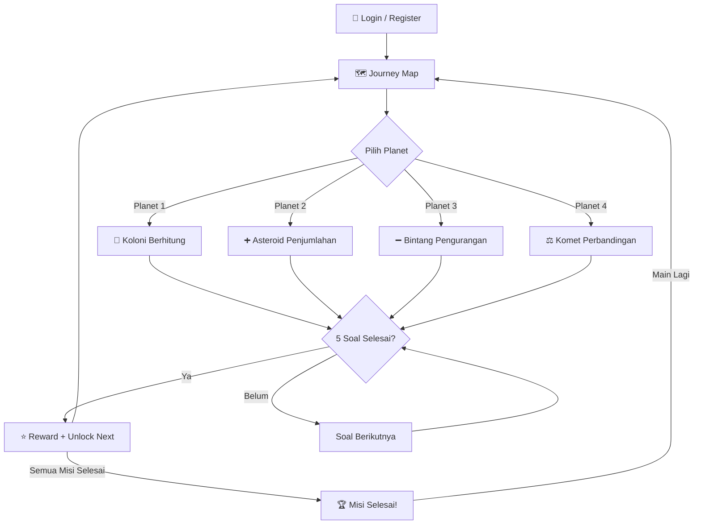

# 🚀 Cosmic Math Adventure — Product Requirements Document

## 1. Ringkasan Proyek

**Cosmic Math Adventure** adalah aplikasi web edukatif interaktif bertema petualangan luar angkasa yang mengajarkan konsep matematika dasar kepada anak-anak usia 6 tahun. Anak-anak berperan sebagai "Kapten Astronaut" yang menjelajahi planet-planet di galaksi, menyelesaikan misi matematika di setiap perhentian.

Aplikasi ini dibangun berdasarkan desain yang telah dibuat di **Google Stitch** (Project ID: `17648462260522569159`), dengan estetika **"Plushy Sci-Fi"** — menggabungkan glassmorphism, neon glow, dan elemen taktil yang ramah anak.

---

## 2. Target Pengguna

| Aspek | Detail |
|---|---|
| **Usia** | 6 tahun (Kelas 1 SD) |
| **Konteks** | Belajar matematika dasar di rumah atau sekolah |
| **Perangkat** | Desktop & Tablet (responsive) |
| **Bahasa** | Bahasa Indonesia |

---

## 3. Tech Stack

| Layer | Teknologi | Justifikasi |
|---|---|---|
| **Framework** | **Nuxt 3** (Vue 3 + SSR) | SEO-friendly, file-based routing, auto-imports |
| **Styling** | **Tailwind CSS v3** | Utility-first, sesuai desain Stitch yang sudah menggunakan Tailwind |
| **Auth & Database** | **Supabase** | Auth (email/social), PostgreSQL database, realtime |
| **Font** | Google Fonts — **Quicksand** (500, 700) | Rounded, ramah anak, sesuai design system |
| **Icons** | Material Symbols Outlined | Konsisten dengan desain Stitch |
| **Deployment** | Vercel / Netlify (TBD) | Zero-config Nuxt deployment |

---

## 4. Design System (Dari Google Stitch)

### 4.1 Color Palette — "Midnight Galaxy"

```css
/* Core Colors */
--background:              #0d1228;   /* Deep space navy */
--surface:                 #0d1228;
--surface-container-low:   #151a31;
--surface-container:       #1d2239;
--surface-container-high:  #272c43;
--surface-container-highest: #333850;

/* Primary — Neon Cyan */
--primary:                 #00f2ff;
--primary-container:       #004e54;
--on-primary:              #00373a;

/* Secondary — Lime Green (Success) */
--secondary:               #4ce346;
--secondary-container:     #04b71a;
--on-secondary:            #003a03;

/* Tertiary — Bright Yellow (Stars/Coins) */
--tertiary:                #cdcd00;
--tertiary-container:      #b1b100;

/* Error */
--error:                   #ffb4ab;
--error-container:         #93000a;

/* Neutral Text */
--on-surface:              #e1e2e9;
--on-surface-variant:      #c4c6d0;
--outline:                 #8e9199;
--outline-variant:         #44474e;
```

### 4.2 Typography

| Token | Font | Size | Weight | Line Height |
|---|---|---|---|---|
| `display-lg` | Quicksand | 48px | 700 | 56px |
| `display-lg-mobile` | Quicksand | 32px | 700 | 40px |
| `headline-md` | Quicksand | 32px | 700 | 40px |
| `headline-md-mobile` | Quicksand | 24px | 700 | 32px |
| `body-lg` | Quicksand | 24px | 500 | 32px |
| `body-sm` | Quicksand | 18px | 500 | 24px |
| `label-bold` | Quicksand | 20px | 700 | 24px |

### 4.3 Spacing (8px base unit)

| Token | Value |
|---|---|
| `xs` | 8px |
| `sm` | 16px |
| `md` | 24px |
| `lg` | 40px |
| `xl` | 64px |
| `container-padding` | 24px |
| `gutter` | 16px |

### 4.4 Border Radius

| Token | Value |
|---|---|
| `DEFAULT` | 1rem (16px) |
| `lg` | 2rem (32px) |
| `xl` | 3rem (48px) |
| `full` | 9999px (Pill) |

### 4.5 Efek Visual Kunci

- **Glassmorphism**: `background: rgba(21, 26, 49, 0.6); backdrop-filter: blur(20px); border: 3px solid rgba(0, 242, 255, 0.2);`
- **Bubbly Button**: `box-shadow: 0 8px 0 0 rgba(0,0,0,0.3);` + `:active { transform: translateY(4px); box-shadow: 0 2px 0 0; }`
- **Float Animation**: `@keyframes float { 0%, 100% { translateY(0) } 50% { translateY(-10px) } }` — 3s infinite
- **Glow Effect**: `filter: drop-shadow(0 0 15px rgba(0, 242, 255, 0.4));`
- **Star Twinkle**: `@keyframes twinkle { from { opacity: 0.05 } to { opacity: 0.5 } }`

---

## 5. Halaman & Layar Aplikasi

### 5.0 Halaman Login / Register (BARU — tidak ada di Stitch)

> **IMPORTANT:** Halaman ini perlu didesain baru mengikuti design system yang sama. Tidak ada mockup di Stitch.

**Deskripsi**: Halaman autentikasi untuk orang tua/guru mendaftarkan akun anak.

**Fitur**:
- Login dengan username & password (Supabase Auth)
- Register akun baru saat pertama kali mengakses website
- Form input bergaya "Answer Bubble" dengan glow effect saat focus
- Background: Animated star field + nebula gradient
- Astronaut character sebagai maskot

**Data yang disimpan saat Register**:
- Username (unik, sebagai identitas login)
- Nama panggilan anak (untuk ditampilkan sebagai "Kapten [Nama]")
- Password

---

### 5.1 Journey Map — Peta Perjalanan (Halaman Utama)

**Stitch Screen**: *"CosmoMath Journey Map"*

**Deskripsi**: Peta utama yang menampilkan 4 planet sebagai perhentian misi. Anak memilih planet untuk memulai misi. Sistem progresif (planet terbuka setelah menyelesaikan planet sebelumnya).

**Elemen UI**:

| Elemen | Detail |
|---|---|
| **Header** | Avatar astronaut (bounce animation) + speech bubble "Halo Kapten! Pilih misimu!" + skor bintang (widget glassmorphism) |
| **Planet 1** | Koloni Berhitung — hijau/cyan, aktif, `active-planet` glow, clickable |
| **Planet 2** | Asteroid Penjumlahan — ungu, locked/unlocked berdasarkan progress |
| **Planet 3** | Bintang Pengurangan — kuning, locked/unlocked |
| **Planet 4** | Komet Perbandingan — biru, locked/unlocked |
| **Orbit Path** | SVG dashed line animasi menghubungkan planet |
| **Bottom Nav** | 4 tab: Journey (aktif), Badges, Store, Profile |
| **Background** | Twinkling stars (60 random elements), radial gradient nebula |

**Interaksi**:
- Klik planet aktif → "squish" (scale 0.9 → 1.1) → navigasi ke misi
- Planet locked → greyscale + ikon gembok, tidak bisa diklik
- Avatar floating animation infinite

---

### 5.2 Misi 1: Koloni Berhitung (Counting)

**Stitch Screen**: *"Misi 1: Koloni Berhitung"*

**Deskripsi**: Anak menghitung jumlah objek (alien ramah) yang ditampilkan, lalu memilih jawaban dari 3 opsi bubble.

**Elemen UI**:

| Elemen | Detail |
|---|---|
| **Header** | Tombol "Kembali ke Peta" (pill-shaped) + Progress bar roket |
| **Instruksi** | Glass panel: "Bantu Astronaut menghitung jumlah alien ramah ini!" |
| **Visual Area** | Grid 3x5 alien illustrations dengan floating animation staggered |
| **Answer Bubbles** | 3 tombol bulat besar (w-32 h-32 → w-48 h-48 di desktop), angka font 64px |
| **Background** | Cosmic gradient + star field |

**Gameplay Logic**:
- Soal di-generate secara acak: tampilkan N objek (1-10), berikan 3 opsi jawaban
- Jawaban benar → confetti burst animation + alert "Bagus sekali!"
- Jawaban salah → shake animation (0.2s, 2x) pada tombol
- 5 soal per sesi misi

---

### 5.3 Misi 2: Asteroid Penjumlahan (Addition)

**Stitch Screen**: *"Misi 2: Asteroid Penjumlahan"*

**Deskripsi**: Anak melihat 2 grup objek (satelit), harus menjumlahkan totalnya.

**Elemen UI**:

| Elemen | Detail |
|---|---|
| **Header** | Back button (bulat) + Rocket progress bar + Pause button |
| **Title** | "Misi 2: Asteroid Penjumlahan" |
| **Equation Area** | Grid 3-kolom: [Grup Kiri: N objek] + [Operator "+"] + [Grup Kanan: M objek] |
| **Grup Kiri** | Glass panel berisi ilustrasi satelit dengan floating + glow effect |
| **Operator** | Tombol bulat hijau (secondary) dengan ikon "add" berukuran 80px |
| **Grup Kanan** | Glass panel serupa grup kiri |
| **Prompt** | "Gabungkan semua satelit! Berapa jumlahnya?" |
| **Answer Buttons** | Grid 2x2 (4 opsi), rounded-xl, border-4, font display-lg |
| **Success Overlay** | Full-screen overlay glassmorphism + bintang + "Hebat!" + tombol "Lanjut" |

**Gameplay Logic**:
- Generate A + B (masing-masing 1-9, total ≤ 10)
- 4 pilihan jawaban, 1 benar
- Benar → success overlay muncul (fade-in)
- Salah → shake + flash merah sesaat (500ms)
- 5 soal per sesi

---

### 5.4 Misi 3: Bintang Pengurangan (Subtraction)

**Stitch Screen**: *"Misi 3: Bintang Pengurangan"*

**Deskripsi**: Narasi cerita — monster memakan kue, anak harus menghitung sisa kue.

**Elemen UI**:

| Elemen | Detail |
|---|---|
| **Header** | Back button + "CosmoMath" title (drop-shadow glow) + Label "Misi 3" |
| **Progress Bar** | Asteroid belt background, roket di 50%, rounded-full |
| **Character + Speech** | Captain Cosmo (floating) + speech bubble: "Monster memakan 2 kue. Sisa berapa kue Astronaut sekarang?" |
| **Playground** | Glass card besar: [Monster illustration] + [Grid kue — 4 utuh + 2 dicoret] |
| **Answer Buttons** | 3 tombol bulat besar: warna primary/tertiary/primary-muted |

**Gameplay Logic**:
- Generate N - M (N=1-10, M=1-N)
- Visual: tampilkan N objek, M ditandai "dimakan" (opacity 30% + ikon X merah)
- 3 pilihan jawaban
- Benar → ring glow + pesan "Hebat! Kamu benar!"
- Salah → shake animation
- 5 soal per sesi

---

### 5.5 Misi 4: Komet Perbandingan (Comparison)

**Stitch Screen**: *"Misi 4: Komet Perbandingan"*

**Deskripsi**: Dua zona menampilkan jumlah bintang berbeda. Anak memilih zona mana yang memiliki LEBIH BANYAK.

**Elemen UI**:

| Elemen | Detail |
|---|---|
| **Header** | Back + "CosmoMath" + Progress bar (95%) + Skor bintang: 1,240 |
| **Instruction** | Glass card: "Bantu Astronaut menemukan planet yang punya LEBIH BANYAK bintang!" |
| **Comparison Zones** | 2 panel besar (grid 1x2): Kiri (N bintang) vs Kanan (M bintang) |
| **Panel Style** | Glass-card, border-4, border primary/secondary, hover glow (30px rgba cyan) |
| **Bintang** | Material icon "star" (FILL 1), warna tertiary (kuning), floating staggered |
| **Angka Transparan** | Angka besar di bawah panel (opacity-20) |
| **Action Buttons** | 2 tombol: "Kiri" / "Kanan" dengan border-b-8 3D press effect |
| **Astronaut** | Ilustrasi astronaut kecil (fixed, bottom-right, bouncing) |

**Gameplay Logic**:
- Generate 2 angka berbeda (1-10)
- Anak memilih "Kiri" atau "Kanan"
- Parallax effect pada hover (bintang bergerak mengikuti kursor)
- 5 soal per sesi

---

### 5.6 Misi Selesai! (Mission Complete)

**Stitch Screen**: *"Misi Selesai!"*

**Deskripsi**: Layar selebrasi setelah menyelesaikan semua misi.

**Elemen UI**:

| Elemen | Detail |
|---|---|
| **Header** | "Misi Antariksa" + help button |
| **Title** | "HORE! KAMU HEBAT, KAPTEN!" (display-lg, uppercase, text-shadow 3D, warna kuning) |
| **Subtitle** | "Semua misi luar angkasa telah selesai!" (headline-md, cyan) |
| **Centerpiece** | Trofi roket + astronaut melompat (floating animation, drop-shadow glow) |
| **Stars** | 3 bintang besar (pulsing glow animation staggered) |
| **Buttons** | "Main Lagi" (replay icon, rotates 180° on hover) + "Kembali ke Peta" (map icon, scales on hover) |
| **Background Glow** | 2 blurred orbs (cyan + blue), fixed position |

---

## 6. Alur Pengguna (User Flow)



---

## 7. Supabase — Authentication & Database

### 7.1 Authentication

- **Provider**: Username/Password (menggunakan Supabase Auth dengan email dummy internal, misal `username@cosmomath.local`)
- **Library**: `@nuxtjs/supabase` module
- **Middleware**: Halaman game dilindungi oleh auth middleware
- **Session**: Persistent via Supabase cookie/session

### 7.2 Database Schema

> Detail lengkap skema database (tabel, kolom, constraints, RLS, triggers, dan SQL migration) tersedia di **[SCHEMA.md](./SCHEMA.md)**.

**Ringkasan tabel:**
- **`profiles`** — Data profil pemain (username, display_name, total_stars)
- **`mission_progress`** — Status unlock & penyelesaian setiap misi per user
- **`game_sessions`** — Riwayat setiap sesi bermain untuk analytics

---

## 8. Struktur Proyek Nuxt

```
cosmic-math-adventure/
├── nuxt.config.ts
├── tailwind.config.ts          # Design system dari Stitch
├── app.vue
├── assets/
│   └── css/
│       └── main.css            # Global styles (glassmorphism, animations)
├── components/
│   ├── AppHeader.vue           # Reusable header (back + progress + score)
│   ├── BottomNav.vue           # Bottom navigation bar
│   ├── PlanetCard.vue          # Planet di Journey Map
│   ├── AnswerBubble.vue        # Tombol jawaban bulat
│   ├── GlassCard.vue           # Container glassmorphism
│   ├── RocketProgress.vue      # Progress bar dengan roket
│   ├── SpeechBubble.vue        # Speech bubble karakter
│   ├── StarReward.vue          # Widget bintang reward
│   ├── SuccessOverlay.vue      # Overlay selebrasi
│   └── TwinklingStars.vue      # Background bintang animasi
├── composables/
│   ├── useGameEngine.ts        # Logic soal matematika, scoring
│   ├── useMissionProgress.ts   # CRUD progress via Supabase
│   └── useConfetti.ts          # Confetti particle effects
├── layouts/
│   ├── default.vue             # Layout dengan bottom nav
│   ├── game.vue                # Layout game (tanpa bottom nav)
│   └── auth.vue                # Layout halaman login/register
├── middleware/
│   └── auth.ts                 # Auth protection middleware
├── pages/
│   ├── index.vue               # Redirect ke /login atau /journey
│   ├── login.vue               # Login page
│   ├── register.vue            # Register page
│   ├── journey.vue             # Journey Map (halaman utama)
│   ├── mission/
│   │   ├── [id].vue            # Dynamic route per misi (1-4)
│   │   └── complete.vue        # Misi Selesai!
│   ├── badges.vue              # (Placeholder) Koleksi badge
│   ├── store.vue               # (Placeholder) Toko reward
│   └── profile.vue             # (Placeholder) Profil user
├── server/
│   └── api/
│       └── ...                 # Server API routes jika diperlukan
├── public/
│   └── images/                 # Aset gambar (astronaut, alien, dll)
└── types/
    └── index.ts                # TypeScript type definitions
```

---

## 9. Sistem Gamifikasi

### 9.1 Scoring

- Setiap jawaban benar = **1 bintang** (⭐)
- Setiap misi = 5 soal = maksimal **5 bintang**
- Total bintang diakumulasikan di profil

### 9.2 Progression

- Misi 1 (Counting) → **selalu terbuka**
- Misi 2 (Addition) → terbuka setelah **Misi 1 selesai** (minimal 3/5 benar)
- Misi 3 (Subtraction) → terbuka setelah **Misi 2 selesai**
- Misi 4 (Comparison) → terbuka setelah **Misi 3 selesai**

### 9.3 Feedback Visual

| Hasil | Visual |
|---|---|
| **Benar** | Confetti burst + glow ring + suara "ding" (opsional) |
| **Salah** | Shake animation + flash merah sesaat |
| **Misi Selesai** | Success overlay + 3 bintang pulsing + trofi |
| **Semua Selesai** | Layar "HORE!" + astronaut jumping |

---

## 10. Catatan & Keputusan yang Diperlukan

### Desain Halaman Login/Register
Tidak ada mockup di Stitch. Halaman ini akan didesain mengikuti design system "Cosmic Explorer" yang sama (dark background, glassmorphism form, Quicksand font, neon glow pada input focus).

### Halaman Placeholder
Badges, Store, dan Profile ditampilkan di bottom nav tapi belum ada desain di Stitch. Akan diimplementasikan sebagai halaman "Coming Soon" terlebih dahulu kecuali ditentukan lain.

### Aset Gambar
Desain Stitch menggunakan gambar dari `lh3.googleusercontent.com/aida-public/...`. Perlu diputuskan apakah menggunakan URL tersebut langsung atau men-download ke folder `public/images/`.

---

## 11. Open Questions

- **Sound Effects** — Apakah ingin menambahkan efek suara (ding untuk benar, buzz untuk salah, musik latar ambient)? Ini bisa meningkatkan engagement anak tetapi perlu aset audio.
- **Difficulty Scaling** — Saat ini desain menunjukkan angka sederhana (1-10). Apakah ingin menambahkan level difficulty (Easy: 1-5, Medium: 1-10, Hard: 1-20) di versi awal, atau cukup satu level?
- **Mobile Responsiveness** — Desain Stitch saat ini dibuat untuk Desktop (1280x1024). Apakah responsiveness ke mobile/tablet menjadi prioritas utama pada versi pertama?

---

## 12. Verification Plan

### Automated Tests
```bash
# Build verification
npm run build

# Type checking
npx nuxi typecheck

# Lint
npm run lint
```

### Manual Verification
- ✅ Halaman login/register (username & password) berfungsi dengan Supabase Auth
- ✅ Journey Map menampilkan planet sesuai progress user
- ✅ Setiap misi menghasilkan soal matematika acak yang benar
- ✅ Feedback visual (confetti, shake, glow) berfungsi sesuai desain Stitch
- ✅ Progress tersimpan di Supabase dan persist antar sesi
- ✅ Unlock misi berurutan berfungsi
- ✅ Responsive di Desktop dan Tablet
- ✅ Design system (warna, font, spacing, animasi) konsisten dengan mockup Stitch
